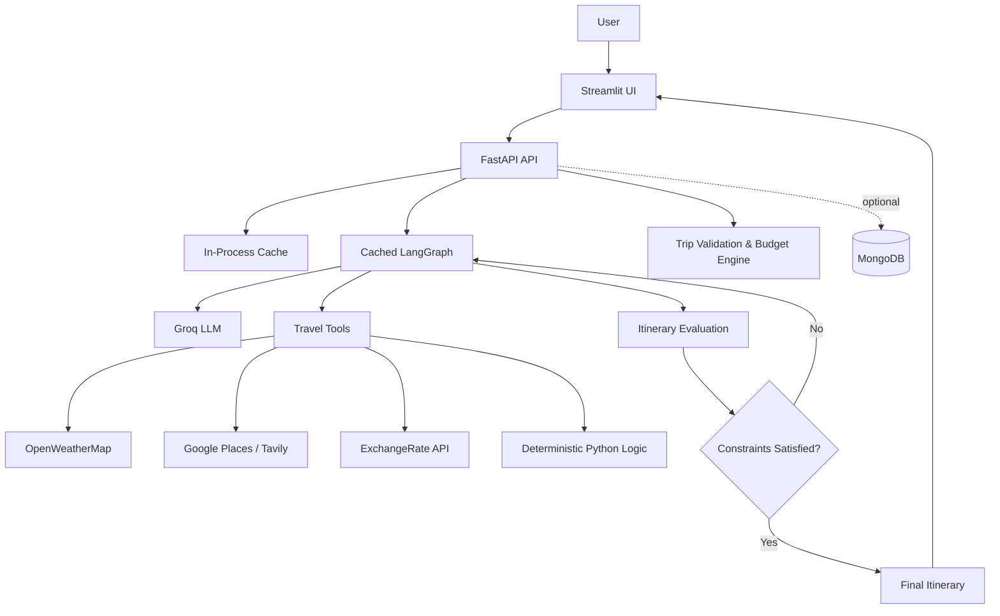

# Agentic Travel Planner

An AI-powered travel planning application that turns a natural-language trip request into a structured itinerary with activities, weather context, transportation suggestions, and cost estimates. The project combines a LangGraph tool-using agent with deterministic Python business logic for budget calculations and a FastAPI plus Streamlit application surface.

The current implementation supports live agent planning, INR-first budgeting, optional external travel APIs, bounded workflow execution, lightweight caching, and graceful operation when MongoDB is unavailable.

## Features

- Natural-language trip planning through a LangGraph agent.
- Day-wise travel plans with attractions, restaurants, activities, transportation, weather, and accommodation suggestions.
- Deterministic hotel, meal, activity, transportation, and daily-budget calculations.
- INR as the default currency with Indian number grouping such as `₹1,000.00` and `₹1,50,000.00`.
- Currency conversion only when the user explicitly requests another currency.
- Optional integrations for Groq, OpenWeatherMap, Google Places, Tavily, and ExchangeRate API.
- FastAPI endpoints for health checks, trip validation, and agent queries.
- Streamlit interface for interacting with the travel agent.
- One cached LangGraph instance per process instead of rebuilding the graph per request.
- Lightweight in-process caching for repeated weather, place-search, and currency requests.
- Network timeouts and graceful fallbacks for optional external services.
- Maximum of two tool or re-planning cycles per request.
- Timing logs for LLM calls, tools, workflow execution, and total request duration.

## Tech Stack

| Technology | Role |
|---|---|
| Python 3.10+ | Application and business-logic language |
| FastAPI | REST API and request validation surface |
| Uvicorn | ASGI development server |
| LangChain | LLM and tool abstractions |
| LangGraph | Stateful agent workflow and tool execution |
| Groq | Default LLM provider |
| Pydantic | Request, response, and configuration validation |
| Streamlit | Lightweight user interface |
| MongoDB / PyMongo | Optional persistence foundation |
| Requests / HTTPX | External API communication |

## Architecture




### Request flow

1. The user submits a natural-language request in Streamlit.
2. Streamlit sends the request to `POST /query`.
3. FastAPI reuses the process-level compiled LangGraph.
4. The LLM decides whether a tool is needed.
5. External tools fetch only the information requested by the workflow.
6. Python performs arithmetic and validation deterministically.
7. The workflow returns a Markdown itinerary to the UI.

The graph is bounded to one initial agent pass plus a maximum of two tool/re-planning cycles. This prevents an unbounded tool loop.

## Project Structure

```text
AI_Trip_Planner-main/
├── agent/
│   └── agentic_workflow.py       Cached LangGraph and workflow limits
├── backend/
│   └── app/
│       ├── main.py               Backend foundation API
│       ├── config.py             Pydantic settings and environment loading
│       ├── database.py           MongoDB connection and collections
│       ├── models/
│       │   ├── trip.py           Trip request validation model
│       │   └── itinerary.py      Activity, day-plan, and itinerary models
│       └── services/
│           ├── budget_engine.py  Deterministic cost calculations
│           └── evaluation.py     Itinerary scoring logic
├── config/
│   └── config.yaml               LLM provider and model configuration
├── prompt_library/
│   └── prompt.py                 Agent behavior and response-format instructions
├── tools/
│   ├── weather_info_tool.py      Weather tools with fallbacks and timing logs
│   ├── place_search_tool.py      Attraction, restaurant, activity, and transport tools
│   ├── currency_conversion_tool.py Currency conversion tool
│   └── expense_calculator_tool.py Deterministic calculation tools
├── utils/
│   ├── model_loader.py           LLM construction with timeout configuration
│   ├── weather_info.py            Weather client with timeout and caching
│   ├── place_info_search.py      Place clients with lightweight caching
│   ├── currency_converter.py     Currency client and INR short-circuit
│   └── expense_calculator.py     Arithmetic helpers and INR formatting
├── main.py                       Existing root FastAPI application
├── streamlit_app.py              Streamlit frontend
├── requirements.txt              Python dependencies
├── .env.example                  Environment-variable template
└── README.md                     Project documentation
```

## Installation and Setup

### Prerequisites

- Windows PowerShell.
- Python 3.10 or newer.
- Internet access for the configured model and external APIs.
- MongoDB only if persistence is required. The chatbot can run without it.

### 1. Open the project

```powershell
cd C:\Users\Admin\Downloads\AI_Trip_Planner-main
```

### 2. Activate the virtual environment

```powershell
Set-ExecutionPolicy -Scope Process -ExecutionPolicy RemoteSigned
.\.venv\Scripts\Activate.ps1
```

If activation is unavailable, use the project interpreter directly:

```powershell
C:\Users\Admin\Downloads\AI_Trip_Planner-main\.venv\Scripts\python.exe
```

### 3. Install dependencies

```powershell
python -m pip install --upgrade pip
python -m pip install -r requirements.txt
```

### 4. Configure environment variables

Create or edit the root `.env` file:

```dotenv
GROQ_API_KEY=your_new_groq_key
OPENAI_API_KEY=
TAVILY_API_KEY=
GPLACES_API_KEY=
OPENWEATHERMAP_API_KEY=
EXCHANGE_RATE_API_KEY=
MONGODB_URI=mongodb://localhost:27017
```

The default model is configured in `config/config.yaml`. Use `TAVILY_API_KEY`, not `TAVILAY_API_KEY`.

### 5. Optional MongoDB setup

The application uses:

```text
Database: agentic_travel_planner
Collections: users, trips, itineraries
```

Without MongoDB, the API reports `database: disconnected` and continues in offline mode. Chatbot generation and deterministic trip validation still work.

## Running Locally

Use two PowerShell terminals and keep both open.

### Terminal 1: FastAPI backend

Run from the `backend` directory:

```powershell
cd C:\Users\Admin\Downloads\AI_Trip_Planner-main\backend
..\.venv\Scripts\python.exe -m uvicorn app.main:app --reload --host 127.0.0.1 --port 8000
```

Backend URL:

```text
http://127.0.0.1:8000
```

### Terminal 2: Streamlit frontend

Run from the project root, not from `backend`:

```powershell
cd C:\Users\Admin\Downloads\AI_Trip_Planner-main
.\.venv\Scripts\python.exe -m streamlit run streamlit_app.py --server.address 127.0.0.1 --server.port 8501
```

Frontend URL:

```text
http://127.0.0.1:8501
```

## Usage

1. Open `http://127.0.0.1:8501`.
2. Enter a request such as:

   ```text
   Plan a 3-day trip to Goa for two people with a budget of ₹50,000. I like beaches, food, and culture.
   ```

3. Submit the form.
4. The agent gathers relevant information, performs deterministic calculations, and returns a Markdown travel plan.
5. Review the trip summary, day-wise activities, budget breakdown, total estimated cost, and budget status.

## Screenshots and Demo

### Local demo

Run the application locally and open:

```text
http://127.0.0.1:8501
```

The repository currently does not contain a deployed public demo URL. Add a verified deployment link here after deploying the application.

### Recommended repository screenshots

For a polished GitHub presentation, capture these real screens after running the project:

1. Streamlit trip request screen.
2. Generated itinerary with day-wise activities.
3. Budget breakdown and within-budget result.
4. FastAPI Swagger page at `/docs`.

Store screenshots under `docs/images/` only when you are ready to add actual product captures. Do not use placeholder screenshots or invented demo links.

## API Documentation

Interactive documentation is available at:

```text
http://127.0.0.1:8000/docs
```

### `GET /health`

Returns application and database status.

```powershell
Invoke-RestMethod http://127.0.0.1:8000/health
```

Example response:

```json
{
  "status": "healthy",
  "application": "Agentic Travel Planner",
  "version": "0.1.0",
  "database": "disconnected"
}
```

### `POST /query`

Runs the LangGraph travel agent.

Request body:

```json
{
  "question": "Plan a 3-day trip to Goa with a budget in INR"
}
```

PowerShell request:

```powershell
$body = @{ question = "Plan a 3-day trip to Goa with a budget in INR" } | ConvertTo-Json
Invoke-RestMethod http://127.0.0.1:8000/query -Method Post -ContentType "application/json" -Body $body
```

Success response shape:

```json
{
  "answer": "## Trip summary ...",
  "currency": "INR"
}
```

The endpoint requires a configured model API key and may use external travel tools depending on the request.

### `POST /api/trips/validate`

Validates trip input and calculates deterministic budget metrics without an LLM call.

Request body:

```json
{
  "destination": "Goa",
  "days": 3,
  "travelers": 2,
  "budget": 50000,
  "interests": ["beaches", "food", "culture"],
  "max_daily_travel_minutes": 180
}
```

PowerShell request:

```powershell
$body = @{
    destination = "Goa"
    days = 3
    travelers = 2
    budget = 50000
    interests = @("beaches", "food", "culture")
    max_daily_travel_minutes = 180
} | ConvertTo-Json

Invoke-RestMethod http://127.0.0.1:8000/api/trips/validate `
    -Method Post `
    -ContentType "application/json" `
    -Body $body
```

